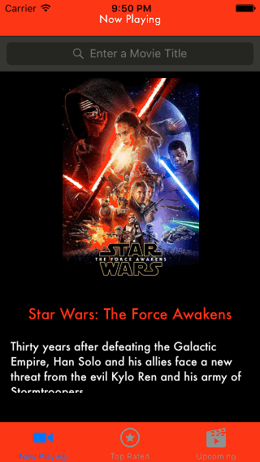

# Project 1 - Flicks

Flicks is a movies app using the [The Movie Database API](http://docs.themoviedb.apiary.io/#).

Time spent: **10** hours spent in total

## User Stories

The following **required** functionality is complete:

- [x] User can view a list of movies currently playing in theaters from The Movie Database.
- [x] Poster images are loaded using the UIImageView category in the AFNetworking library.
- [x] User sees a loading state while waiting for the movies API.
- [x] User can pull to refresh the movie list.
- [x] User sees an error message when there's a networking error.  

The following **optional** features are implemented:

- [x] Movies are displayed using a CollectionView instead of a TableView.
- [x] User can select from a tab bar for either "Now Playing" or "Top Rated" movies.
- [x] User can search for a movie.
- [x] All images fade in as they are loading.
- [x] Customize the UI.

The following **additional** features are implemented:

- [x] Made Overview text scrollable
- [x] Added Upcoming tab

## Video Walkthrough 

Here's a walkthrough of implemented user stories:

GIF created with [GifGrabber](https://itunes.apple.com/us/app/gifgrabber/id668208984?mt=12).

## Notes

Describe any challenges encountered while building the app.

* Initially had issues with getting the search bar working. Eventually figured it out with tutorials

# Project 2 - *Flicks*

**Flicks** is a movies app displaying box office and top rental DVDs using [The Movie Database API](http://docs.themoviedb.apiary.io/#).

Time spent: **X** hours spent in total

## User Stories

The following **required** functionality is completed:

- [x] User can view movie details by tapping on a cell.
- [x] User can select from a tab bar for either **Now Playing** or **Top Rated** movies.
- [x] Customize the selection effect of the cell.

The following **optional** features are implemented:

- [x] For the large poster, load the low resolution image first and then switch to the high resolution image when complete.
- [x] Customize the navigation bar.

The following **additional** features are implemented:

- [x] UI Redesign

## Video Walkthrough 

Here's a walkthrough of implemented user stories:

GIF created with [GifGrabber](https://itunes.apple.com/us/app/gifgrabber/id668208984?mt=12).

## Notes

Describe any challenges encountered while building the app.

* The Upcoming movies json had a a missing poster_path for a movie, so I had to write workaround that checks if the value is null. It then replaces it with an image not found image.

## License

    Copyright 2016 John Henning

    Licensed under the Apache License, Version 2.0 (the "License");
    you may not use this file except in compliance with the License.
    You may obtain a copy of the License at

        http://www.apache.org/licenses/LICENSE-2.0

    Unless required by applicable law or agreed to in writing, software
    distributed under the License is distributed on an "AS IS" BASIS,
    WITHOUT WARRANTIES OR CONDITIONS OF ANY KIND, either express or implied.
    See the License for the specific language governing permissions and
    limitations under the License.
